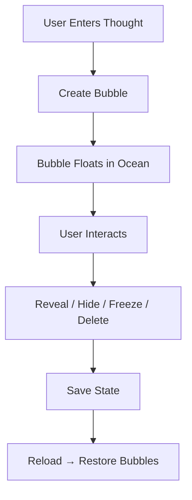

# 🌊 Ocean of Thoughts

> *“Some thoughts float. Some sink. All of them stay.”*

---

## 🌌 Overview

**Ocean of Thoughts** is an interactive web experience where your thoughts become **living, floating bubbles** in a digital ocean.

Each thought:

* drifts
* reacts
* evolves
* and sometimes hides

This is not just visualization…
It’s **interaction with your mind**.

---

## ⚡ Core Concept

> Thoughts are like bubbles in an ocean.
> Some rise. Some disappear. Some wait to be seen.

* 🫧 Thoughts → bubbles
* 🖱️ Click → reveal / hide
* 🎮 Interaction → changes behavior
* 💾 Memory → persists across sessions

---

## 🌿 Features

✨ Floating animated thought bubbles
🌌 Dynamic ocean background (waves + particles)
🧠 Auto-generated subconscious thoughts
🎮 Click → reveal / hide thoughts
🖱️ Double-click → freeze bubble
❌ Right-click → delete bubble
🎨 Mood system (changes colors & environment)
📊 Real-time stats dashboard
💾 LocalStorage persistence (remembers everything)

---

## 🧪 How It Works



---

## 🎮 Experience

1. Type a thought
2. Watch it float as a bubble
3. Click to reveal it
4. Let it drift… or remove it

> ⚠️ Some thoughts are easier to reveal than others.

---

## 🎨 Mood System

Change the **entire ocean vibe**:

* 🌊 Calm → peaceful blue
* 🌌 Deep → dark introspective
* 🌩️ Storm → chaotic energy
* 💭 Dream → surreal colors

---

## 🧠 Interaction Controls

| Action           | Effect                |
| ---------------- | --------------------- |
| Click            | Reveal / Hide thought |
| Double Click     | Freeze bubble         |
| Right Click      | Delete bubble         |
| Background Click | Create random thought |

---

## 📊 Stats Panel

* Total thoughts
* Revealed thoughts
* Hidden thoughts
* Current mood

---

## 📂 Project Structure

```id="ocean-struct"
📁 Ocean-of-Thoughts
 ├── index.html
 ├── README.md
```

---

## 🚀 Run Locally

```bash id="ocean-run"
# Clone repository
git clone https://github.com/your-username/ocean-of-thoughts

# Open in browser
index.html
```

---

## 🔥 Advanced Systems

### 🌌 Particle + Wave Engine

Canvas-based animation simulating:

* ocean depth
* floating motion
* subtle environmental movement

---

### 🧠 Thought Engine

* user input + auto thoughts
* random generation
* persistent storage

---

### 🎮 Bubble Physics

* upward drift
* mouse attraction
* boundary collision
* respawn behavior

---

## 🧩 Hidden Meaning

> You don’t control your thoughts completely.
> You only choose which ones to reveal.

---

## 🤝 Contributing

Fork it. Expand it.
Add new layers to the ocean.

---

## 📜 License

MIT License — Flow freely.

---

## 🌑 Final Thought

> “The ocean doesn’t judge what falls into it…
> it simply holds everything.”

---

⭐ If this made you pause… the ocean worked.
